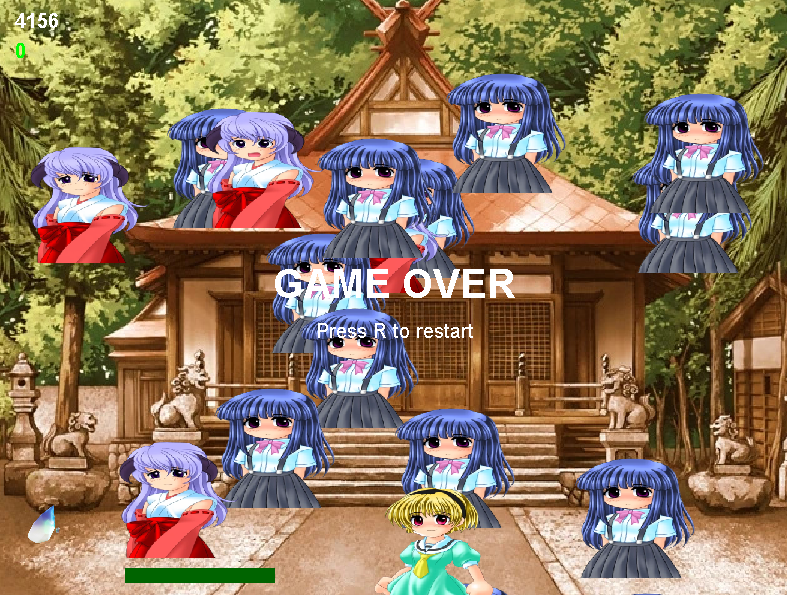

# Higurashi Bounce Rika

Bounce Rika-themed balls endlessly using your paddle, survive the onslaught of cuteness, and unlock increasingly unpredictable characters. A tribute to Rika's eternal loops — now in arcade form.


---

## About the Game

- Control the paddle using **← Left** and **→ Right** arrow keys.
- You start with **30 lives**. Each missed ball = -1 life.
- Every **6 successful bounces**, a new ball joins the chaos.
- Press **R** to restart anytime.
- Press **F5** to toggle **Endless Mode** (infinite lives, no score).

---

## Ball Types

| Ball Type     | Description |
|---------------|-------------|
|  **RikaBall**  | Default bouncy ball — nothing too fancy. |
|  **SatokoBall**| Spawns at 1000 score — moves faster! |
|  **HanyuuBall**| Spawns at 2000 score — has a 10% chance per bounce to give you +1 life. |
|  **RenaBall**  | Spawns at 3000 score — unpredictable bounces for extra challenge. |

## Requirements
- Java 8 or higher
- Works on Windows, Linux, MacOS (as long as Java is installed)

---

## How to run

Download the game from [itch.io](https://uranyuke235.itch.io/higurashi-bounce-rika)

*or*

```bash
java -jar RikaBounce.jar
```